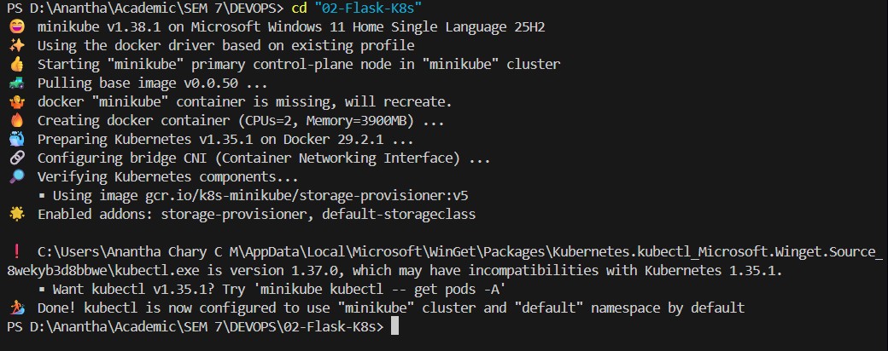
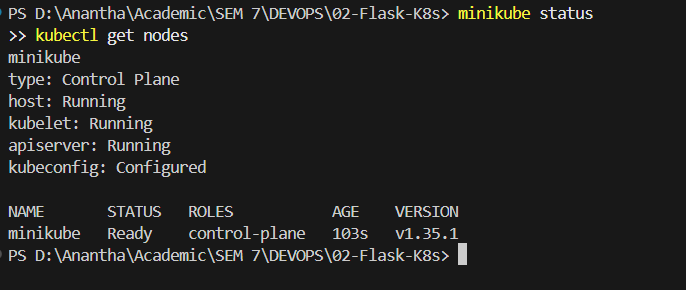
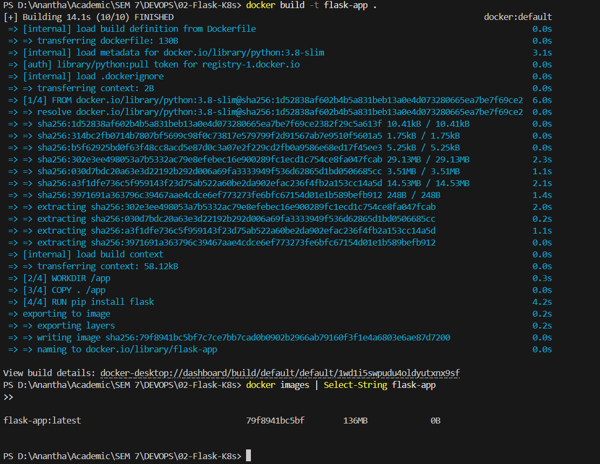
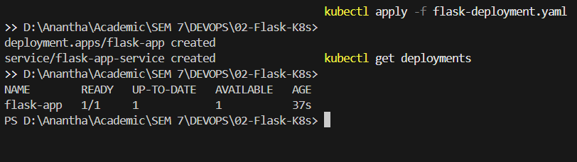
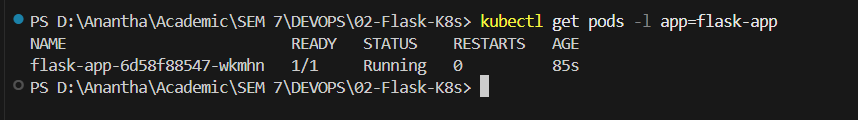
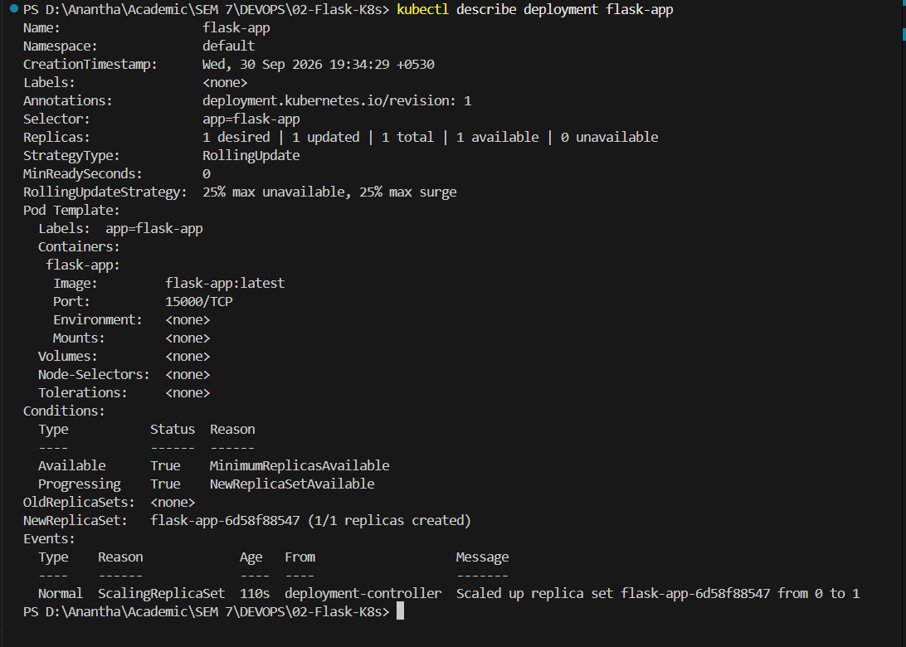
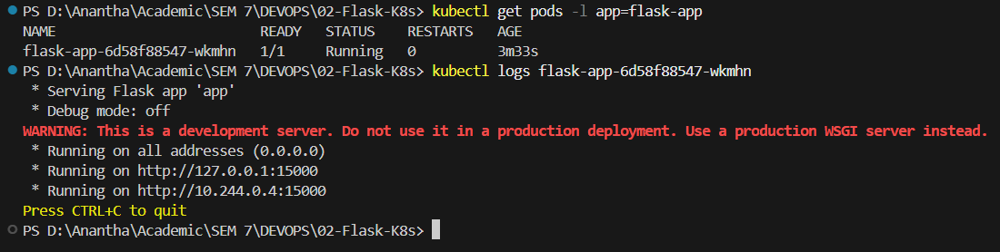
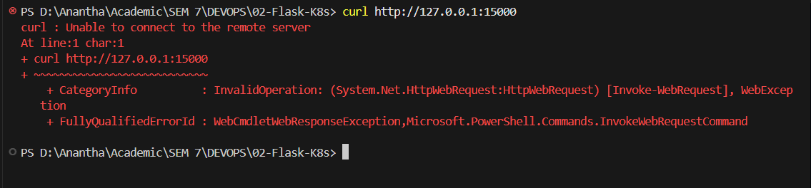
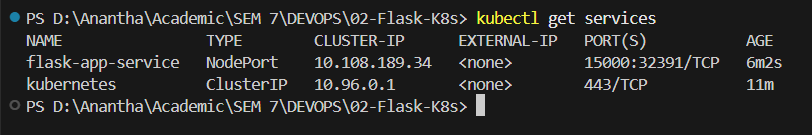
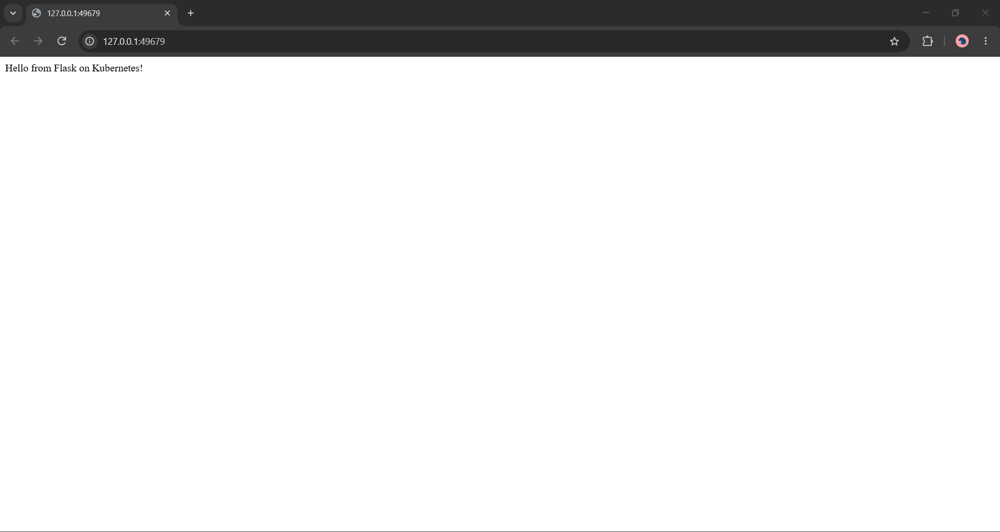

Name: Anantha Chary C M
USN: 1BM23IS025

# Lab 02: Deploy a Flask App on Kubernetes using Minikube, kubectl & YAML

## Objective
Deploy a Python Flask web application as a containerized Kubernetes Deployment using Minikube on Windows 11, expose it using a `NodePort` Service defined in a YAML manifest, access it through HTTP, and record evidence of successful deployment.

---

## Environment Setup
* **OS:** Windows 11 Home Single Language
* **Container Runtime:** Docker Desktop
* **Minikube Version:** `v1.38.1`
* **Kubernetes Version:** `v1.35.1`
* **CLI Tools:** `kubectl`, `minikube`, `docker`
* **Application:** Python Flask (port `15000`)

---

## Step-by-Step Execution

### 1. Start & Verify Minikube Cluster
```powershell
minikube start --driver=docker
minikube status
kubectl get nodes
```
* **Status:** Host, kubelet, apiserver, and kubeconfig fully running. Node `minikube` in `Ready` status.

### 2. Create Flask Application (`app.py`)
```python
from flask import Flask
app = Flask(__name__)

@app.route('/')
def home():
    return "Hello from Flask on Kubernetes!"

if __name__ == '__main__':
    app.run(host='0.0.0.0', port=15000)
```

### 3. Create Dockerfile
```dockerfile
FROM python:3.8-slim
WORKDIR /app
COPY . /app
RUN pip install flask
CMD ["python", "app.py"]
```

### 4. Build Docker Image Inside Minikube
```powershell
& minikube -p minikube docker-env --shell powershell | Invoke-Expression
docker build -t flask-app .
docker images | Select-String flask-app
```
* **Status:** Image `flask-app:latest` built successfully inside Minikube's Docker daemon.

### 5. Deploy Application Using YAML (`flask-deployment.yaml`)
```powershell
kubectl apply -f flask-deployment.yaml
kubectl get deployments
kubectl get pods -l app=flask-app
```
* **Status:** Deployment `flask-app` with `1/1` Ready. Pod showing `1/1 Running`.

### 6. Inspect Deployment & Logs
```powershell
kubectl describe deployment flask-app
kubectl logs <pod-name>
```
* **Status:** Flask server running on `0.0.0.0:15000` inside the container.

### 7. Verify Direct Access Fails
```powershell
curl http://127.0.0.1:15000
```
* **Status:** Connection refused — port 15000 is internal to the pod, not exposed to the host.

### 8. Expose via NodePort Service & Access
```powershell
kubectl get services
minikube service flask-app-service --url
curl http://127.0.0.1:<assigned-port>
```
* **Status:** Service `flask-app-service` created with type `NodePort`. Flask app accessible via Minikube tunnel URL.

---

## Deployment Evidence

### Minikube Start


### Minikube Status & Nodes


### Docker Build


### Deployment Ready


### Pods Running


### Describe Deployment


### Pod Logs


### Direct Access Fails


### Service Created


### Flask Response


---

## Verification Summary
| Item | Status |
|------|--------|
| **Deployment Status** | `flask-app` (1/1 Ready) |
| **Pod Status** | `flask-app-xxxxxxx` (1/1 Running) |
| **Container Image** | `flask-app:latest` (imagePullPolicy: Never) |
| **Service Status** | `flask-app-service` (NodePort) |
| **Container Port** | `15000` |
| **HTTP Access** | `Hello from Flask on Kubernetes!` |
