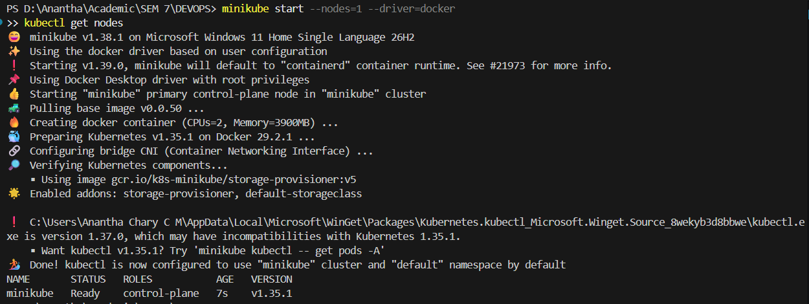
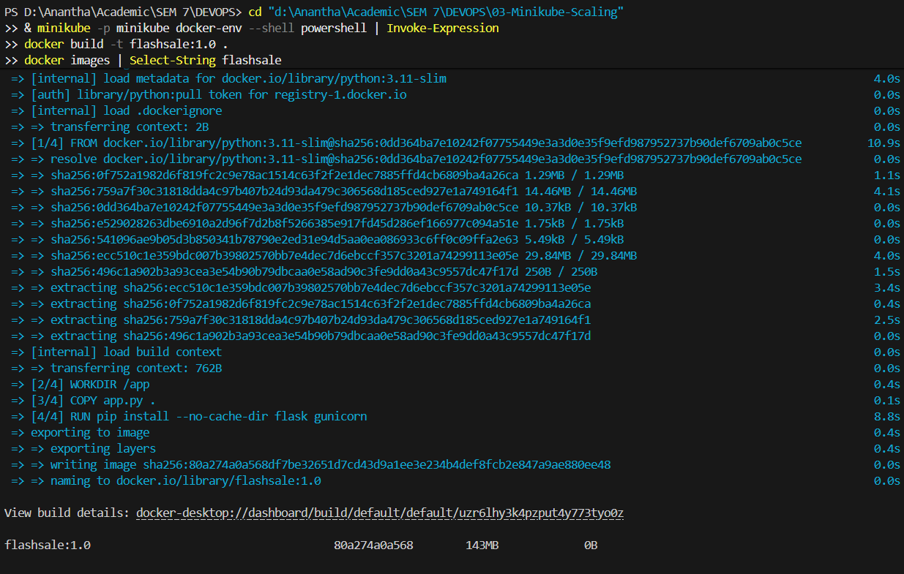
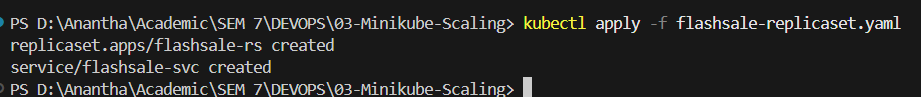
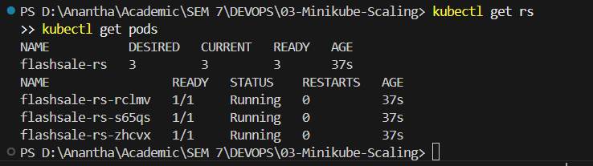
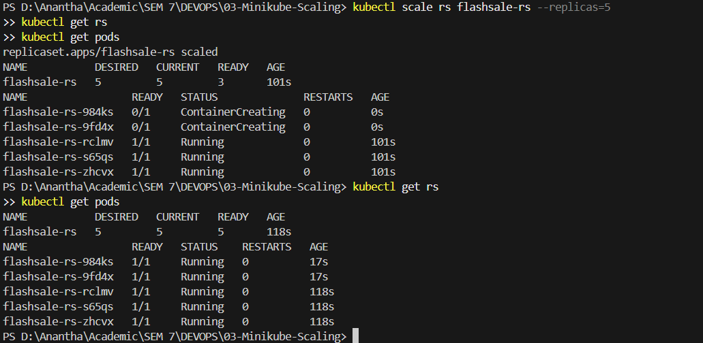
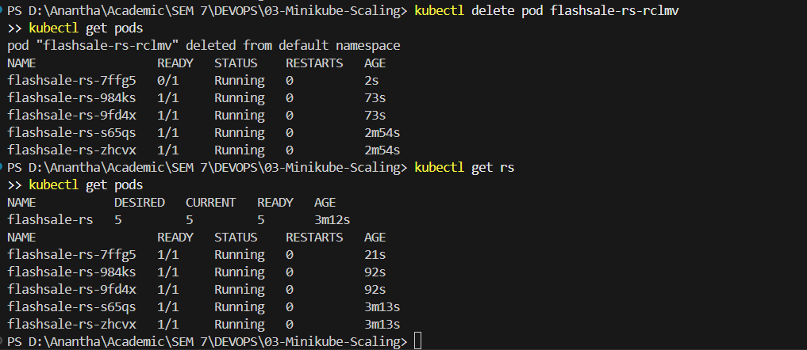
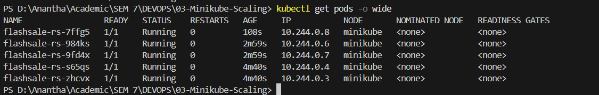
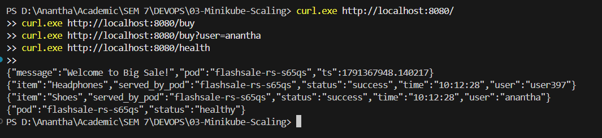

Name: Anantha Chary C M
USN: 1BM23IS025

# Lab 03: Scaling Flask App on Kubernetes using ReplicaSets (Minikube)

## Objective
Deploy a Python Flask "Flash Sale" application on a Minikube Kubernetes cluster, scale it using ReplicaSets, demonstrate self-healing by deleting pods, observe pod distribution, and verify load distribution across replicas.

---

## Environment Setup
* **OS:** Windows 11 Home Single Language
* **Container Runtime:** Docker Desktop
* **Minikube Version:** `v1.38.1`
* **Kubernetes Version:** `v1.35.1`
* **CLI Tools:** `kubectl`, `minikube`, `docker`
* **Application:** Python Flask with Gunicorn (port `5000`)

---

## Concept: Why ReplicaSets?

**Real-Life Use Case — E-commerce Flash Sale:**

| Scenario | Without ReplicaSets | With ReplicaSets |
|----------|-------------------|--------------------|
| Normal traffic (100 req/min) | Single pod works fine | 3 pods running |
| Flash sale spike (10,000 req/min) | Pod crashes under load | Scale to 10–20 pods instantly |
| Sale ends | Manual restart needed | Scale back down automatically |

**Key Learnings:**
- **Pod Distribution** → Each pod is an identical worker clone of your app
- **Resiliency** → If one pod fails, ReplicaSet auto-creates a replacement
- **Efficiency** → Add pods on demand, remove when load drops
- **Real-world usage** → How Netflix, YouTube, Swiggy scale their microservices

---

## Step-by-Step Execution

### 1. Clean Up Previous Cluster & Start Single-Node Minikube
```powershell
minikube stop
minikube delete
minikube start --nodes=1 --driver=docker
kubectl get nodes
```
* **Status:** Single node `minikube` in `Ready` status with role `control-plane`.

### 2. Create Flask Application (`app.py`)
```python
from flask import Flask, request
import socket, time, random

app = Flask(__name__)

@app.get("/")
def homepage():
    return {
        "message": "Welcome to Big Sale!",
        "pod": socket.gethostname(),
        "ts": time.time()
    }

@app.get("/buy")
def buy():
    # simulate a flash sale checkout
    item = random.choice(["Smartphone", "Shoes", "Headphones", "Laptop"])
    user = request.args.get("user", f"user{random.randint(1,1000)}")
    return {
        "status": "success",
        "item": item,
        "user": user,
        "served_by_pod": socket.gethostname(),
        "time": time.strftime("%H:%M:%S")
    }

@app.get("/health")
def health():
    return {"status": "healthy", "pod": socket.gethostname()}
```
**Endpoints:**
- `/` → Welcome page showing which pod served the request
- `/buy` → Simulates a flash sale checkout with random product
- `/health` → Health check endpoint for Kubernetes readiness/liveness probes

### 3. Create Dockerfile
```dockerfile
FROM python:3.11-slim
WORKDIR /app
COPY app.py .
RUN pip install --no-cache-dir flask gunicorn
CMD ["gunicorn","-b","0.0.0.0:5000","app:app","--workers","1","--threads","2"]
```

### 4. Build Docker Image Inside Minikube
```powershell
& minikube -p minikube docker-env --shell powershell | Invoke-Expression
docker build -t flashsale:1.0 .
docker images | Select-String flashsale
```
* **Status:** Image `flashsale:1.0` built successfully inside Minikube's Docker daemon.

### 5. Create & Apply ReplicaSet YAML (`flashsale-replicaset.yaml`)
```powershell
kubectl apply -f flashsale-replicaset.yaml
```
* **Status:** `replicaset.apps/flashsale-rs created` and `service/flashsale-svc created`.

**YAML Highlights:**
- **ReplicaSet** with `replicas: 3` — starts 3 identical pods
- **readinessProbe** — checks `/health` before accepting traffic
- **livenessProbe** — restarts the pod if `/health` stops responding
- **Resource limits** — CPU 100m–500m, Memory 128Mi–256Mi
- **Service (ClusterIP)** — exposes pods on port 80, forwarding to container port 5000
- **`imagePullPolicy: Never`** — uses the locally built image

### 6. Verify ReplicaSet & Pods (3 Replicas)
```powershell
kubectl get rs
kubectl get pods
```
* **Status:** ReplicaSet `flashsale-rs` showing `3/3` READY. All 3 pods in `1/1 Running` state.

### 7. Scale Up to 5 Replicas
```powershell
kubectl scale rs flashsale-rs --replicas=5
kubectl get rs
kubectl get pods
```
* **Status:** ReplicaSet scaled to 5 replicas. 2 new pods created with smaller AGE values.

### 8. Test Self-Healing — Delete a Pod
```powershell
kubectl delete pod <pod-name>
kubectl get pods
```
* **Status:** Deleted pod automatically replaced by a new one. Total count remains at 5 — demonstrating Kubernetes self-healing.

### 9. View Pod Distribution Across Nodes
```powershell
kubectl get pods -o wide
```
* **Status:** All 5 pods running on the single `minikube` node, each with a unique internal IP address.

### 10. Access the Flash Sale App
```powershell
kubectl port-forward service/flashsale-svc 8080:80
# In a new terminal:
curl http://localhost:8080/
curl http://localhost:8080/buy
curl http://localhost:8080/buy?user=anantha
curl http://localhost:8080/health
```
* **Status:** Flask app accessible via port-forward. Running `/buy` multiple times shows different `served_by_pod` values — demonstrating load distribution across replicas.

---

## Deployment Evidence

### Minikube Start & Nodes


### Docker Build


### Apply ReplicaSet


### Pods Running (3 Replicas)


### Scale Up to 5 Replicas


### Self-Healing — Pod Auto-Replaced


### Pod Distribution (Wide View)


### Flask App Response


---

## Verification Summary

| Item | Expected Value |
|------|----------------|
| **ReplicaSet Name** | `flashsale-rs` |
| **Initial Replicas** | `3` |
| **Scaled Replicas** | `5` |
| **Pod Status** | All `1/1 Running` |
| **Service Name** | `flashsale-svc` |
| **Service Type** | `ClusterIP` |
| **Self-Healing** | Deleted pod auto-replaced |
| **Node Count** | `1` (single minikube node) |
| **All Pods on Same Node** | Yes |
| **HTTP Response** | JSON with pod name and sale data |
