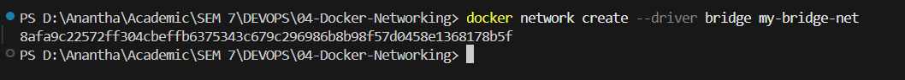
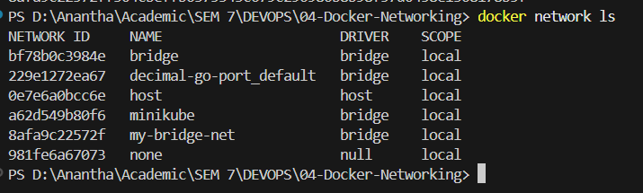
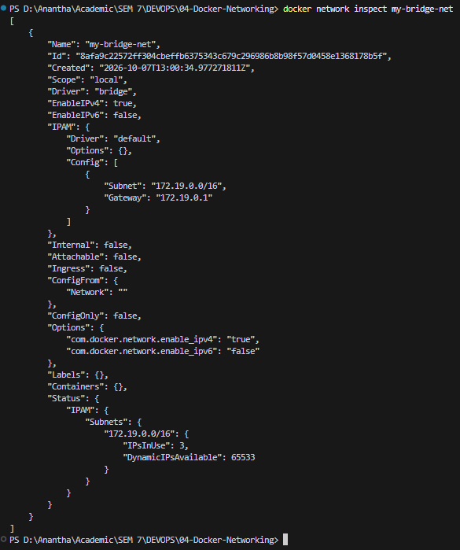

Name: Anantha Chary C M
USN: 1BM23IS025

# Lab 04: Docker Networking with Multi-Container Application

## Objective
Understand Docker networking concepts by configuring a multi-container application with a Flask REST API, MySQL database, and Redis cache — all communicating over a custom bridge network.

---

## Environment Setup
* **OS:** Windows 11 Home Single Language
* **Container Runtime:** Docker Desktop
* **CLI Tools:** `docker`
* **Application:** Python Flask REST API (port `5001`)

---

## Concept: Docker Bridge Networking

**Why custom bridge networks?**

| Feature | Default Bridge | Custom Bridge (`my-bridge-net`) |
|---------|---------------|-------------------------------|
| Container name DNS | ❌ Not supported | ✅ Automatic DNS resolution |
| Isolation | Shared with all default containers | Only explicitly connected containers |
| Communication | Must use IP addresses | Use container names directly |

**Real-Life Use Case — Microservice Architecture:**
- **Web server** (Flask) communicates with a **database** (MySQL) and a **cache** (Redis)
- Each service runs in its own isolated container
- Containers discover each other by **name** instead of fragile IP addresses
- The custom bridge network acts as a private LAN for your microservices

---

## Architecture

```
┌──────────────────── my-bridge-net (Custom Bridge) ────────────────────┐
│                                                                       │
│  ┌───────────────┐    ┌───────────────┐    ┌───────────────┐         │
│  │  Flask API    │    │    MySQL      │    │    Redis      │         │
│  │  (flask-api)  │◄──►│  (mysql)      │    │  (redis)      │         │
│  │  Port: 5001   │    │  Port: 3306   │    │  Port: 6379   │         │
│  └───────┬───────┘    └───────────────┘    └───────────────┘         │
│          │                                                            │
└──────────┼────────────────────────────────────────────────────────────┘
           │ -p 5001:5001
           ▼
     Host: localhost:5001
```

---

## Step-by-Step Execution

### 1. Create a Custom Bridge Network
```powershell
docker network create --driver bridge my-bridge-net
```
* **Status:** Network `my-bridge-net` created — returns a network ID hash.

### 2. Verify the Network
```powershell
docker network ls
```
* **Status:** `my-bridge-net` listed with driver `bridge` and scope `local`.

### 3. Inspect the Network (Empty)
```powershell
docker network inspect my-bridge-net
```
* **Status:** Network details shown — subnet `172.18.0.0/16`, gateway `172.18.0.1`, empty `Containers` field (no containers connected yet).

### 4. Create the Flask Application
```python
# app.py
from flask import Flask, jsonify

app = Flask(__name__)

@app.route('/about', methods=['GET'])
def about():
    return jsonify({
        "name": "Simple REST API",
        "version": "1.0",
        "description": "This is a simple REST API built with Flask."
    })

if __name__ == '__main__':
    app.run(debug=True, host='0.0.0.0', port=5001)
```

**Dependencies (`requirements.txt`):**
```
Flask==2.0.1
```

### 5. Create the Dockerfile
```dockerfile
FROM python:3.9-slim
WORKDIR /app
COPY requirements.txt .
COPY app.py .
RUN pip install --no-cache-dir -r requirements.txt
EXPOSE 5001
CMD ["python", "app.py"]
```

### 6. Build the Flask Docker Image
```powershell
docker build -t flask-api .
docker images | Select-String flask-api
```
* **Status:** Image `flask-api:latest` built successfully.

### 7. Launch All Three Containers on the Bridge Network
```powershell
# Launch MySQL container
docker run -d --name mysql --net=my-bridge-net -e MYSQL_ROOT_PASSWORD=root123 mysql:latest

# Launch Redis container
docker run -d --name redis --net=my-bridge-net redis:latest

# Launch Flask container (with port mapping)
docker run -d --name flask --net=my-bridge-net -p 5001:5001 flask-api
```
**Flags explained:**
- `-d` → Detached mode (background)
- `--net=my-bridge-net` → Connect to the custom bridge network
- `-p 5001:5001` → Map Flask container port to host
- `-e MYSQL_ROOT_PASSWORD=root123` → Required MySQL environment variable

```powershell
docker ps
```
* **Status:** All 3 containers (`flask`, `mysql`, `redis`) running on `my-bridge-net`.

### 8. Test the Flask API
```powershell
curl http://localhost:5001/about
```
**Expected response:**
```json
{
  "description": "This is a simple REST API built with Flask.",
  "name": "Simple REST API",
  "version": "1.0"
}
```
* **Status:** Flask API accessible from host via port-forwarded `localhost:5001`.

### 9. Test Container-to-Container Connectivity
```powershell
docker exec -it flask bash
```
Inside the Flask container:
```bash
# Ping MySQL container by name
ping mysql -c 3

# Ping Redis container by name
ping redis -c 3

exit
```
* **Status:** Both pings successful — Docker DNS resolves container names (`mysql`, `redis`) to their internal IP addresses on the `my-bridge-net` network.

### 10. Inspect the Network (With Containers)
```powershell
docker network inspect my-bridge-net
```
* **Status:** `Containers` field now shows all three containers with their assigned IP addresses — confirming they are connected to the same bridge network.

---

## Deployment Evidence

### Create Network


### Network List


### Network Inspect (Empty)


### Flask App & Requirements


### Dockerfile


### Docker Build


### Containers Running


### Flask API Response


### Ping MySQL


### Ping Redis


### Network Inspect (With Containers)


### Cleanup


---

## Verification Summary

| Item | Expected Value |
|------|---------------|
| **Network Name** | `my-bridge-net` |
| **Network Driver** | `bridge` |
| **Flask Container** | Running on port `5001` |
| **MySQL Container** | Running on port `3306` |
| **Redis Container** | Running on port `6379` |
| **Flask → MySQL Ping** | Successful (via container name) |
| **Flask → Redis Ping** | Successful (via container name) |
| **Flask API Response** | JSON at `http://localhost:5001/about` |

---

## Cleanup

```powershell
# Stop and remove all three containers
docker stop mysql redis flask
docker rm mysql redis flask

# Remove the custom network
docker network rm my-bridge-net

# Verify cleanup
docker ps -a
docker network ls
```

---

## Viva Questions & Answers

1. **What is the purpose of the `--net` flag in `docker run`?**
   The `--net` flag specifies which Docker network the container should be connected to. This determines how the container can communicate with other containers and the host.

2. **How do containers communicate with each other on the same network?**
   Containers on the same custom bridge network communicate using their container names or IP addresses. Docker provides built-in DNS resolution for container names on user-defined networks.

3. **What is the difference between a bridge network and a host network?**
   - **Bridge Network:** Containers are isolated in a private network and communicate through Docker's internal DNS. Ports must be explicitly mapped to the host.
   - **Host Network:** Containers share the host's network stack directly — no port mapping needed, but no network isolation.

4. **How can you expose a container's port to the host machine?**
   Use the `-p` (publish) flag during `docker run`. For example, `-p 5001:5001` maps port 5001 inside the container to port 5001 on the host.
