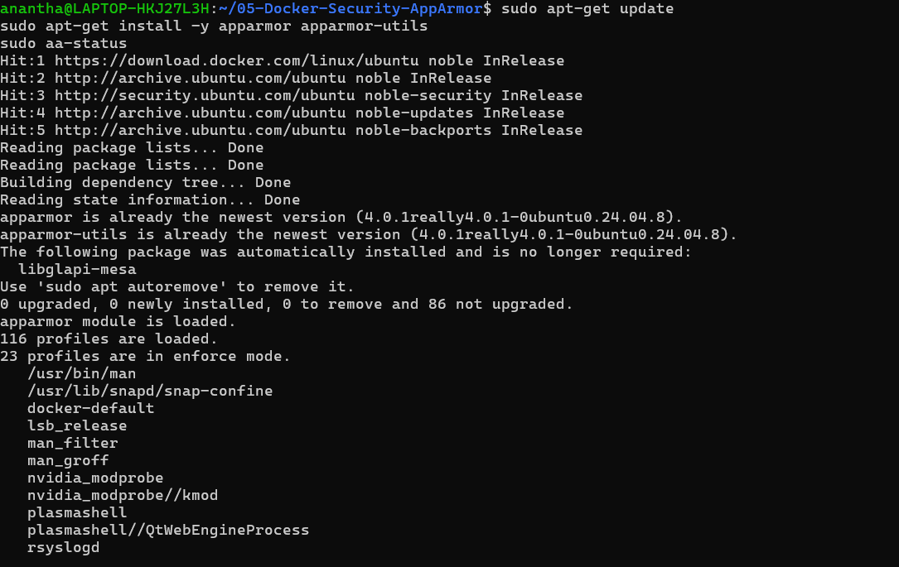
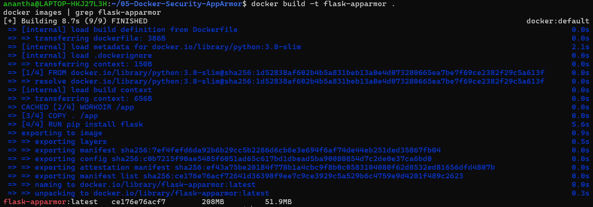
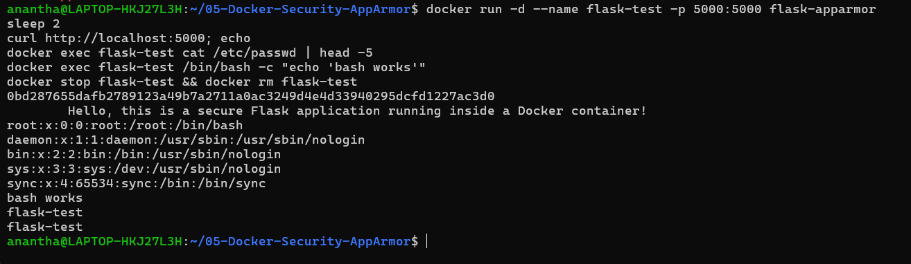
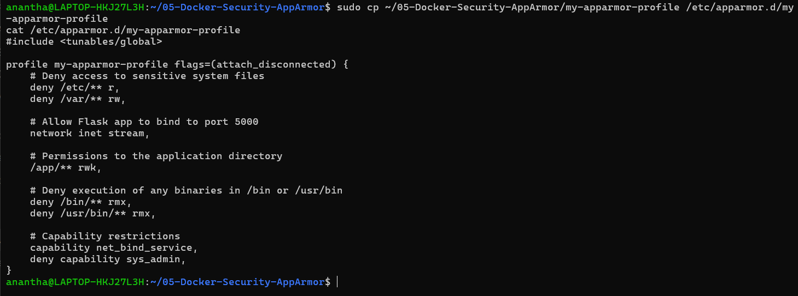
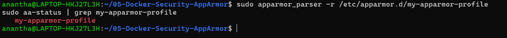
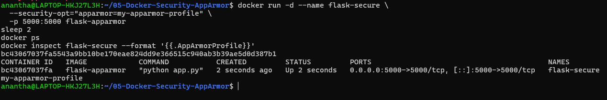
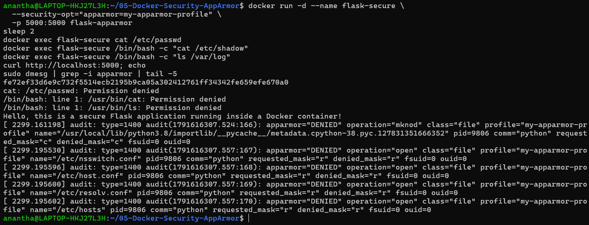
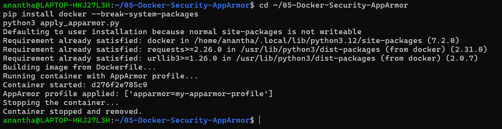
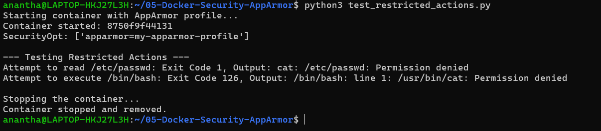

Name: Anantha Chary C M
USN: 1BM23IS025

# Lab 05: Docker Security with AppArmor and Python

## Objective

Secure Docker containers using **AppArmor profiles** to restrict access to sensitive directories (`/etc/`, `/var/`), prevent execution of unauthorized binaries (`/bin/bash`), apply security policies using the Docker SDK for Python, and test/verify restricted actions inside the container.

---

## Environment Setup

- **OS:** Ubuntu (native Linux host — see note below)
- **Container Runtime:** Docker Engine (`docker.io` / `docker-ce`)
- **CLI Tools:** `docker`, `apparmor_parser`, `aa-status`
- **Language:** Python 3.x with Flask
- **Application:** Python Flask web app (port `5000`)

> **AppArmor is a Linux-only LSM.** It must be enforced by the kernel that runs the containers.
> **Docker Desktop on Windows/WSL 2 will NOT work for this lab** — containers run inside Docker Desktop's own LinuxKit VM, which has no AppArmor module loaded. Running `aa-status` inside a WSL Ubuntu distro only reports that distro's state, not the container runtime's. On that setup `--security-opt apparmor=...` is silently ignored or fails, and the restricted-action tests pass when they should be blocked.
> Use a native Ubuntu host, a Linux VM, or a cloud Linux instance.

Check the runtime actually supports it:

```bash
docker info | grep -i apparmor      # expect: Security Options: ... apparmor
cat /sys/module/apparmor/parameters/enabled   # expect: Y
```

---

## Concept: AppArmor & Container Security

**What is AppArmor?**
AppArmor (Application Armor) is a Linux kernel security module that enforces **mandatory access control (MAC)** policies. It confines programs to a limited set of resources by defining what files, directories, network capabilities, and system calls a process can access.

**Why use AppArmor with Docker?**

| Aspect              | Without AppArmor                                 | With AppArmor                                   |
| ------------------- | ------------------------------------------------ | ----------------------------------------------- |
| File Access         | Container can read `/etc/passwd`, system configs | ❌ Blocked by profile rules                     |
| Binary Execution    | `/bin/bash`, `/bin/sh` freely accessible         | ❌ Denied execution                             |
| Network             | Unrestricted                                     | ✅ Only allowed protocols (e.g., TCP for Flask) |
| System Capabilities | `sys_admin` and others available                 | ❌ Explicitly denied                            |

**Real-Life Use Case — Production Container Hardening:**

- A Flask web application serves HTTP traffic but should **never** read system configuration files or spawn shell processes
- AppArmor profiles enforce the **principle of least privilege** — the container can only do what it needs to
- Even if an attacker exploits a vulnerability in the app, they cannot escalate privileges or access sensitive host data

---

## Architecture

```
┌─────────────── AppArmor Profile (my-apparmor-profile) ───────────────┐
│                                                                       │
│  ALLOW:                          DENY:                                │
│  ✅ /app/** (rwk)                ❌ /etc/** (read)                    │
│  ✅ network inet stream          ❌ /var/** (read/write)              │
│  ✅ capability net_bind_service  ❌ /bin/** (execute)                 │
│                                  ❌ /usr/bin/** (execute)             │
│                                  ❌ capability sys_admin              │
│                                                                       │
│  ┌─────────────────────────────────────────┐                         │
│  │  Flask Container (flask-secure)         │                         │
│  │  Image: flask-apparmor                  │                         │
│  │  Port: 5000                             │                         │
│  │  Security: --security-opt=apparmor=...  │                         │
│  └─────────────────────────────────────────┘                         │
│                                                                       │
└───────────────────────────────────────────────────────────────────────┘
```

---

## Step-by-Step Execution

### 1. Install AppArmor Utilities

```bash
sudo apt-get update
sudo apt-get install -y apparmor-utils
```

Verify AppArmor is active:

```bash
sudo aa-status
```

- **Status:** List of loaded AppArmor profiles displayed with their modes (enforce/complain).

### 2. Create the Flask Application

```python
# app.py
from flask import Flask

app = Flask(__name__)

@app.route('/')
def home():
    return "Hello, this is a secure Flask application running inside a Docker container!"

if __name__ == '__main__':
    app.run(host='0.0.0.0', port=5000)
```

### 3. Create the Dockerfile

```dockerfile
FROM python:3.8-slim
WORKDIR /app
COPY . /app
RUN pip install flask
EXPOSE 5000
CMD ["python", "app.py"]
```

### 4. Build the Docker Image

```bash
docker build -t flask-apparmor .
docker images | grep flask-apparmor
```

- **Status:** Image `flask-apparmor:latest` built successfully.

### 5. Baseline Test — Without AppArmor

Run the container without any security restrictions to establish a baseline:

```bash
docker run -d --name flask-test -p 5000:5000 flask-apparmor
```

Test that the app works:

```bash
curl http://localhost:5000
```

**Expected:** `Hello, this is a secure Flask application running inside a Docker container!`

Test that sensitive actions are currently **allowed** (no security):

```bash
# Read sensitive file (should succeed without AppArmor)
docker exec flask-test cat /etc/passwd

# Execute bash (should succeed without AppArmor)
docker exec flask-test /bin/bash -c "echo 'bash works'"
```

- **Status:** Both commands succeed — this is the **insecure baseline**.

Stop and remove the test container:

```bash
docker stop flask-test && docker rm flask-test
```

### 6. Create the AppArmor Profile

Save the following profile to `/etc/apparmor.d/my-apparmor-profile`:

```bash
sudo nano /etc/apparmor.d/my-apparmor-profile
```

Profile content:

```
#include <tunables/global>

profile my-apparmor-profile flags=(attach_disconnected) {
    # Deny access to sensitive system files
    deny /etc/** r,
    deny /var/** rw,

    # Allow Flask app to bind to port 5000
    network inet stream,

    # Permissions to the application directory
    /app/** rwk,

    # Deny execution of any binaries in /bin or /usr/bin
    deny /bin/** rmix,
    deny /usr/bin/** rmix,

    # Capability restrictions
    capability net_bind_service,
    deny capability sys_admin,
}
```

> **Why `profile my-apparmor-profile { ... }` and not `/usr/bin/python3 { ... }`?**
> `apparmor_parser` registers a profile under the name in its head. A path head registers the name `/usr/bin/python3`, so `docker run --security-opt apparmor=my-apparmor-profile` fails with `apparmor profile "my-apparmor-profile" not found`. Docker matches by **profile name**, so the profile must be explicitly named. `flags=(attach_disconnected)` prevents denials on container mount namespaces where paths cannot be resolved from the host root.

**Profile Breakdown:**

| Rule                          | Effect                                                       |
| ----------------------------- | ------------------------------------------------------------ |
| `deny /etc/** r`              | Blocks reading any files under `/etc/` (e.g., `/etc/passwd`) |
| `deny /var/** rw`             | Blocks reading/writing under `/var/`                         |
| `network inet stream`         | Allows TCP networking (needed for Flask)                     |
| `/app/** rwk`                 | Allows read/write/lock access to the app directory           |
| `deny /bin/** rmix`           | Blocks read/mmap/inherit-execute of binaries in `/bin/`      |
| `deny /usr/bin/** rmix`       | Blocks read/mmap/inherit-execute of binaries in `/usr/bin/`  |
| `capability net_bind_service` | Allows binding to network ports                              |
| `deny capability sys_admin`   | Blocks system admin capabilities                             |

### 7. Load the AppArmor Profile

```bash
sudo apparmor_parser -r /etc/apparmor.d/my-apparmor-profile
sudo aa-status | grep my-apparmor-profile
```

- **Status:** Profile `my-apparmor-profile` appears in the list of loaded profiles **by that exact name**.

### 8. Run the Container WITH AppArmor Profile

```bash
docker run -d --name flask-secure \
  --security-opt="apparmor=my-apparmor-profile" \
  -p 5000:5000 \
  flask-apparmor
```

**Flags explained:**

- `--security-opt="apparmor=my-apparmor-profile"` → Apply the AppArmor profile to the container
- `-p 5000:5000` → Map container port to host

```bash
docker ps
docker inspect flask-secure --format '{{.AppArmorProfile}}'
```

- **Status:** Container `flask-secure` running with AppArmor profile applied.

### 9. Test Restricted Actions (Manual)

Test the same sensitive actions — they should now be **blocked** by AppArmor:

```bash
# Attempt to read /etc/passwd (should be DENIED)
docker exec flask-secure cat /etc/passwd

# Attempt to execute /bin/bash (should be DENIED)
docker exec flask-secure /bin/bash -c "echo 'bash works'"
```

**Expected output:**

```
cat: /etc/passwd: Permission denied
OCI runtime exec failed: ... permission denied
```

> **Note on exit codes:** `cat` itself lives in `/bin/`, so under this profile the `cat /etc/passwd` attempt can be denied at **exec** time (exit `126`) rather than at **read** time (exit `1`). Either outcome proves the policy is enforcing — record whichever your run produces. Denials are logged by the kernel:
>
> ```bash
> sudo dmesg | grep -i apparmor | tail
> sudo journalctl -k | grep DENIED | tail
> ```

Verify the Flask app still works:

```bash
curl http://localhost:5000
```

**Expected:** `Hello, this is a secure Flask application running inside a Docker container!`

- **Key Observation:** The AppArmor profile blocks sensitive actions while allowing the Flask application to run normally. This is **mandatory access control** in action.

Stop and remove:

```bash
docker stop flask-secure && docker rm flask-secure
```

> **If the container exits immediately** instead of serving traffic, see [Appendix A](#appendix-a--functional-profile-variant). `deny /etc/** r` also blocks `/etc/ld.so.cache`, which the dynamic linker reads before `main()` — on some bases the interpreter never starts.

### 10. Apply AppArmor Profile via Docker SDK for Python

Install the Docker SDK:

```bash
pip install docker
```

Run the Python script:

```bash
python apply_apparmor.py
```

```python
# apply_apparmor.py
import docker

client = docker.from_env()

print("Building image from Dockerfile...")
client.images.build(path=".", tag="flask-apparmor")

print("Running container with AppArmor profile...")
container = client.containers.run(
    "flask-apparmor",
    name="flask-secure-sdk",
    ports={'5000/tcp': 5000},
    security_opt=["apparmor=my-apparmor-profile"],
    detach=True
)

print(f"Container started: {container.short_id}")

container_info = client.api.inspect_container(container.id)
apparmor_profile = container_info['HostConfig']['SecurityOpt']
print(f"AppArmor profile applied: {apparmor_profile}")

print("Stopping the container...")
container.stop()
container.remove()
print("Container stopped and removed.")
```

**Expected output:**

```
Building image from Dockerfile...
Running container with AppArmor profile...
Container started: f8c2a7f9
AppArmor profile applied: ['apparmor=my-apparmor-profile']
Stopping the container...
Container stopped and removed.
```

### 11. Test Restricted Actions with Python Script

```bash
python test_restricted_actions.py
```

```python
# test_restricted_actions.py
import docker

client = docker.from_env()

print("Starting container with AppArmor profile...")
container = client.containers.run(
    "flask-apparmor",
    name="flask-secure-test",
    ports={'5000/tcp': 5000},
    security_opt=["apparmor=my-apparmor-profile"],
    detach=True
)

print(f"Container started: {container.short_id}")

info = client.api.inspect_container(container.id)
print(f"SecurityOpt: {info['HostConfig']['SecurityOpt']}")

print("\n--- Testing Restricted Actions ---")

exit_code, output = container.exec_run("cat /etc/passwd")
print(f"Attempt to read /etc/passwd: Exit Code {exit_code}, Output: {output.decode().strip()}")

exit_code, output = container.exec_run("/bin/bash -c 'echo bash works'")
print(f"Attempt to execute /bin/bash: Exit Code {exit_code}, Output: {output.decode().strip()}")

print("\nStopping the container...")
container.stop()
container.remove()
print("Container stopped and removed.")
```

**Expected output:**

```
Starting container with AppArmor profile...
Container started: f8c2a7f9
SecurityOpt: ['apparmor=my-apparmor-profile']

--- Testing Restricted Actions ---
Attempt to read /etc/passwd: Exit Code 1, Output:
Attempt to execute /bin/bash: Exit Code 126, Output:

Stopping the container...
Container stopped and removed.
```

- **Exit Code 1** for `cat /etc/passwd` → Permission denied (AppArmor blocked the file read)
- **Exit Code 126** for `/bin/bash` → Permission denied (AppArmor blocked binary execution)

---

## Appendix A — Functional Profile Variant

The lab profile is a pure whitelist with a blanket `deny /etc/** r`. AppArmor denies always override allows, so `/etc/ld.so.cache` cannot be carved back out — on images where the loader needs it, the interpreter never starts and the "Flask still responds" check cannot pass.

`my-apparmor-profile-working` keeps the same security intent but denies the specific files the lab tests, while leaving the runtime loadable:

```
#include <tunables/global>

profile my-apparmor-profile flags=(attach_disconnected) {
    #include <abstractions/base>

    # Runtime
    /usr/local/bin/python3.8 ix,
    /usr/local/bin/python    ix,
    /usr/local/** rm,
    /lib/** rm,
    /usr/lib/** rm,
    /tmp/** rw,

    # Application
    /app/** rwk,

    # Networking
    network inet stream,
    network inet6 stream,
    capability net_bind_service,

    # Restrictions
    deny /etc/passwd r,
    deny /etc/shadow r,
    deny /etc/group r,
    deny /var/** rw,
    deny /bin/** rmix,
    deny /usr/bin/** rmix,
    deny capability sys_admin,
}
```

Load it the same way (it registers under the same profile name):

```bash
sudo cp my-apparmor-profile-working /etc/apparmor.d/my-apparmor-profile
sudo apparmor_parser -r /etc/apparmor.d/my-apparmor-profile
```

Tip for tuning any profile: load it in **complain** mode first, exercise the app, then convert logged denials into rules.

```bash
sudo aa-complain /etc/apparmor.d/my-apparmor-profile
sudo aa-logprof
sudo aa-enforce /etc/apparmor.d/my-apparmor-profile
```

---

## Deployment Evidence

### AppArmor Installation & Status



### Docker Image Build



### Baseline Test (Without AppArmor)



### AppArmor Profile



### Load AppArmor Profile



### Container With AppArmor



### Restricted Actions Test (Manual)



### Apply AppArmor via Python SDK



### Test Restricted Actions via Python



---

## Verification Summary

| Item                     | Expected Value                                                       |
| ------------------------ | -------------------------------------------------------------------- |
| **Docker Image**         | `flask-apparmor:latest`                                              |
| **AppArmor Profile**     | `my-apparmor-profile` loaded (named profile, visible in `aa-status`) |
| **Runtime Support**      | `docker info` lists `apparmor` under Security Options                |
| **Flask App**            | Responds at `http://localhost:5000`                                  |
| **Read `/etc/passwd`**   | ❌ Blocked (Exit Code 1, or 126 if `cat` exec is denied first)       |
| **Execute `/bin/bash`**  | ❌ Blocked (Exit Code 126)                                           |
| **Network Access**       | ✅ Allowed (Flask serves HTTP)                                       |
| **App Directory Access** | ✅ Allowed (`/app/**` readable)                                      |
| **Docker SDK Script**    | Successfully applies and verifies profile                            |
| **Kernel Log**           | `DENIED` entries present in `dmesg` / `journalctl -k`                |

---

## Cleanup

```bash
# Stop and remove any running containers
docker stop flask-secure flask-test flask-secure-sdk flask-secure-test 2>/dev/null
docker rm flask-secure flask-test flask-secure-sdk flask-secure-test 2>/dev/null

# Remove the Docker image
docker rmi flask-apparmor

# Unload and remove the AppArmor profile
sudo apparmor_parser -R /etc/apparmor.d/my-apparmor-profile 2>/dev/null
sudo rm /etc/apparmor.d/my-apparmor-profile

# Verify cleanup
docker ps -a
docker images | grep flask-apparmor
sudo aa-status | grep my-apparmor-profile
```

---
