Name: Anantha Chary C M
USN: 1BM23IS025

# Lab 06: Real-Time Monitoring with Prometheus & Grafana (Quick Commerce App)

## Objective

As a DevOps engineer at **ZAPPTTO** (a quick commerce delivery service), build a real-time monitoring pipeline that simulates delivery metrics, visualizes them on dashboards, and sets up automated alerts to ensure smooth operations and quick problem detection.

| Component             | Tool                         | Purpose                                           |
| --------------------- | ---------------------------- | ------------------------------------------------- |
| **Metrics Simulator** | Python + `prometheus-client` | Simulates delivery metrics                        |
| **Metrics Scraper**   | Prometheus                   | Scrapes and stores the metrics                    |
| **Visualization**     | Grafana                      | Dashboards with real-time graphs                  |
| **Alerting**          | Prometheus alert rules       | Fires on high pending deliveries / high avg time  |
| **Automation**        | Jenkins                      | Pipeline that builds and launches the whole stack |

---

## Prerequisites

| Tool                                            | Purpose                             |
| ----------------------------------------------- | ----------------------------------- |
| **Docker** (Engine in WSL 2, or Docker Desktop) | Containerizing and running services |
| **Python 3.10+**                                | Metrics simulation script           |
| **pip**                                         | To install `prometheus-client`      |
| **Jenkins**                                     | Pipeline automation (Step 14)       |
| **Prometheus**                                  | Metrics scraping                    |
| **Grafana**                                     | Visualization                       |

> **Note:** `--network=host` only behaves as documented on **Linux / WSL 2**. On Docker Desktop for Windows it is a no-op — use the `-p 9090:9090` + `host.docker.internal` variant (see Troubleshooting).

---

## Concept: Prometheus & Grafana Monitoring

**What is Prometheus?**
Prometheus is an open-source systems monitoring and alerting toolkit. It collects metrics from configured targets at given intervals, evaluates rule expressions, displays the results, and can trigger alerts when specified conditions are observed.

**What is Grafana?**
Grafana is an open-source platform for monitoring and observability. It provides dashboards and visualizations for time-series data from sources like Prometheus.

**Why use them together?**

| Aspect          | Prometheus                        | Grafana                               |
| --------------- | --------------------------------- | ------------------------------------- |
| Data Collection | ✅ Scrapes `/metrics` endpoints   | ❌ Does not collect data              |
| Querying        | ✅ PromQL for ad-hoc queries      | ✅ Uses PromQL via data source        |
| Alerting        | ✅ Alert rules with firing states | ✅ Alert notifications (email, Slack) |
| Visualization   | ⚠️ Basic graph tab                | ✅ Rich dashboards, panels, themes    |

**Metric Types:**

| Type          | Description                    | Example                    |
| ------------- | ------------------------------ | -------------------------- |
| **Counter**   | Monotonically increasing value | Total requests served      |
| **Gauge**     | Value that goes up and down    | Current pending deliveries |
| **Histogram** | Bucketed distribution          | Request duration buckets   |
| **Summary**   | Quantiles (percentiles)        | Average delivery time      |

---

## Architecture

```
┌──────────────────────────────────────────────────────────────────┐
│                     Monitoring Pipeline                          │
│                                                                  │
│  ┌─────────────────┐    scrapes     ┌────────────────────┐      │
│  │  Python App      │ ◄──────────── │  Prometheus         │      │
│  │  (port 8000)     │   /metrics    │  (port 9090)        │      │
│  │  delivery_metrics│               │  + alert_rules.yml  │      │
│  └─────────────────┘               └────────┬───────────┘      │
│                                              │ data source      │
│                                              ▼                  │
│                                    ┌────────────────────┐      │
│                                    │  Grafana            │      │
│                                    │  (port 3000)        │      │
│                                    │  Dashboard panels   │      │
│                                    └────────────────────┘      │
│                                                                  │
│  ┌──────────────────────────────────────────────────────┐       │
│  │  Jenkins Pipeline (port 8080)                        │       │
│  │  Builds image → Runs app → Deploys Prometheus/Grafana │       │
│  └──────────────────────────────────────────────────────┘       │
└──────────────────────────────────────────────────────────────────┘
```

---

## Step-by-Step Execution

### 1. Install the Prometheus Client Library

```bash
pip3 install prometheus-client
```

If pip refuses with `externally-managed-environment` (Ubuntu 22.04+):

```bash
pip3 install prometheus-client --break-system-packages
```

### 2. Create the Project Directory Structure

```bash
mkdir delivery_monitoring
cd delivery_monitoring
```

Final structure:

```
delivery_monitoring/
├── delivery_metrics.py   # Python script to simulate metrics
├── prometheus.yml        # Prometheus configuration
├── alert_rules.yml       # Alert rules configuration
├── Dockerfile            # Image for the metrics app (used by Jenkins)
├── Jenkinsfile           # Jenkins pipeline script
```

### 3. Write the Python Metrics Application

Create `delivery_metrics.py`:

```python
from prometheus_client import start_http_server, Summary, Gauge
import random
import time

# Metrics
total_deliveries = Gauge("total_deliveries", "Total number of deliveries")
pending_deliveries = Gauge("pending_deliveries", "Number of pending deliveries")
on_the_way_deliveries = Gauge("on_the_way_deliveries", "Number of deliveries on the way")
average_delivery_time = Summary("average_delivery_time", "Average delivery time in seconds")

# Simulate delivery statuses
def simulate_delivery():
    pending = random.randint(10, 20)      # Ensure values exceed the alert threshold
    on_the_way = random.randint(5, 20)
    delivered = random.randint(30, 70)
    avg_time = random.uniform(15, 45)

    total = pending + on_the_way + delivered

    print(f"[DEBUG] Total deliveries: {total}")
    print(f"[DEBUG] Pending deliveries: {pending}")
    print(f"[DEBUG] On-the-way deliveries: {on_the_way}")
    print(f"[DEBUG] Average delivery time: {avg_time:.2f} seconds")

    total_deliveries.set(total)
    pending_deliveries.set(pending)
    on_the_way_deliveries.set(on_the_way)
    average_delivery_time.observe(avg_time)

if __name__ == "__main__":
    print("[INFO] Starting the HTTP server on port 8000...")
    start_http_server(8000, addr="0.0.0.0")
    print("[INFO] HTTP server started. Simulating deliveries...")
    while True:
        simulate_delivery()
        print("[INFO] Sleeping for 1 second...")
        time.sleep(1)
```

> **About `/metrics`:**
>
> - The endpoint is created automatically by `prometheus_client` when `start_http_server` runs; default port **8000**
> - Each metric has a **name**, a **description** and a **type**
> - Prometheus GETs `http://<host>:8000/metrics` at the default **15s interval**

### 4. Run the Metrics Script

```bash
python3 delivery_metrics.py
```

**Expected output:**

```
[INFO] Starting the HTTP server on port 8000...
[INFO] HTTP server started. Simulating deliveries...
[DEBUG] Total deliveries: 69
[DEBUG] Pending deliveries: 20
[DEBUG] On-the-way deliveries: 17
[DEBUG] Average delivery time: 28.26 seconds
[INFO] Sleeping for 1 second...
```

> **Keep this terminal running** — Prometheus scrapes this process.

In a **new terminal**, verify the metrics endpoint:

```bash
curl http://localhost:8000/metrics
```

Shows Prometheus-format output: `python_gc_*`, `process_*`, plus `total_deliveries`, `pending_deliveries`, `on_the_way_deliveries`, `average_delivery_time_*`.

### 5. Configure Prometheus

Create `prometheus.yml`:

```yaml
scrape_configs:
  - job_name: "prometheus"
    static_configs:
      - targets: ["localhost:9090"]

  - job_name: "delivery_service"
    static_configs:
      - targets: ["172.17.0.1:8000"]

rule_files:
  - /etc/prometheus/alert_rules.yml
```

> **Configuration notes:**
>
> - `scrape_configs` defines scraping jobs — each `job_name` is a target group
> - `targets` specifies host endpoints Prometheus will scrape
> - **Linux / WSL** → use `172.17.0.1` (the `docker0` bridge gateway, confirm with `ip addr show docker0`)
> - **macOS / Windows native Docker** → use `host.docker.internal`
> - Scrape interval defaults to **15s**

### 6. Configure Alert Rules

Create `alert_rules.yml`:

```yaml
groups:
  - name: delivery_alerts
    rules:
      - alert: HighPendingDeliveries
        expr: pending_deliveries > 10
        for: 15s
        labels:
          severity: warning
        annotations:
          summary: "High pending deliveries"
          description: "Pending deliveries are above 10 for the last 15 seconds."

      - alert: HighAverageDeliveryTime
        expr: (average_delivery_time_sum / average_delivery_time_count) > 30
        labels:
          severity: critical
        annotations:
          summary: "High average delivery time"
          description: "Average delivery time is above 30 seconds."
```

### 7. Run Prometheus as a Docker Container

```bash
docker run -d --name prometheus \
  --network=host \
  -v $(pwd)/prometheus.yml:/etc/prometheus/prometheus.yml \
  -v $(pwd)/alert_rules.yml:/etc/prometheus/alert_rules.yml \
  prom/prometheus
```

> `--network=host` makes the container share the host network stack, so it reaches `172.17.0.1:8000` and serves on `localhost:9090` without `-p`.

Verify:

```bash
docker ps | grep prometheus
ip addr show docker0        # confirms the 172.17.0.1 gateway
```

Open `http://localhost:9090`.

### 8. Verify Prometheus Targets

Prometheus UI → **Status → Targets**.

| Job                | Target            | State |
| ------------------ | ----------------- | ----- |
| `prometheus`       | `localhost:9090`  | UP    |
| `delivery_service` | `172.17.0.1:8000` | UP    |

> If `delivery_service` is **DOWN**: the Python script must still be running, and the target host must be correct (`host.docker.internal:8000` on Windows/macOS).

### 9. Test Prometheus Queries

| Query                                                     | Shows                  |
| --------------------------------------------------------- | ---------------------- |
| `total_deliveries`                                        | Total deliveries gauge |
| `pending_deliveries`                                      | Pending deliveries     |
| `on_the_way_deliveries`                                   | On-the-way deliveries  |
| `average_delivery_time_sum / average_delivery_time_count` | Average delivery time  |

Execute → **Graph** tab.

### 10. Run Grafana as a Docker Container

```bash
docker run -d --name grafana -p 3000:3000 grafana/grafana
docker ps | grep grafana
```

Open `http://localhost:3000` — **admin / admin**, then **Skip** the password change.

### 11. Add Prometheus as a Data Source

1. **Home → Connections → Data sources → Add data source → Prometheus**
2. URL: `http://172.17.0.1:9090` (Windows/macOS native: `http://host.docker.internal:9090`)
3. Leave the rest default → **Save & Test**

**Expected:** "Successfully queried the Prometheus API."

### 12. Create the Grafana Dashboard

**Home → Dashboards → New Dashboard → Add visualization**, create 4 panels:

| Panel                 | Query                                                     | Visualization |
| --------------------- | --------------------------------------------------------- | ------------- |
| Total Deliveries      | `total_deliveries`                                        | Stat or Gauge |
| Pending Deliveries    | `pending_deliveries`                                      | Time Series   |
| On-the-Way Deliveries | `on_the_way_deliveries`                                   | Time Series   |
| Avg Delivery Time     | `average_delivery_time_sum / average_delivery_time_count` | Time Series   |

Save as **"Delivery Monitoring"**.

### 13. Verify Alerts in Prometheus

Open `http://localhost:9090/alerts`:

- **HighPendingDeliveries** → `FIRING` (pending is always > 10)
- **HighAverageDeliveryTime** → `FIRING` or `PENDING` depending on the random values

### 14. Automate the Stack with a Jenkins Pipeline

#### 14a. Check for an existing Jenkins container

```bash
docker ps -a | grep jenkins
docker rm <container-id>     # only if an old/exited instance is in the way
```

#### 14b. Start Jenkins

```bash
docker run -d -p 8080:8080 -p 50000:50000 --name jenkins \
  -v jenkins_home:/var/jenkins_home \
  -v /var/run/docker.sock:/var/run/docker.sock \
  jenkins/jenkins:lts
```

> **Important:** The extra `-v /var/run/docker.sock:/var/run/docker.sock` is required — the pipeline runs `docker` commands, and the stock Jenkins image has neither the Docker CLI nor access to the daemon. Install the CLI inside the container:
>
> ```bash
> docker exec -it -u root jenkins bash
> apt-get update && apt-get install -y docker.io
> chmod 666 /var/run/docker.sock
> exit
> ```

Initial admin password:

```bash
docker exec -it jenkins cat /var/jenkins_home/secrets/initialAdminPassword
```

Open `http://localhost:8080`, unlock, install suggested plugins, create the admin user.

#### 14c. Create the Dockerfile for the Metrics App

The pipeline runs `docker build -t delivery_metrics .` — `Dockerfile`:

```dockerfile
FROM python:3.10-slim
WORKDIR /app
COPY delivery_metrics.py /app/
RUN pip install prometheus-client
EXPOSE 8000
CMD ["python", "delivery_metrics.py"]
```

#### 14d. Create the Jenkinsfile

```groovy
pipeline {
    agent any

    stages {
        stage('Pre-check Docker') {
            steps {
                script {
                    def dockerVersion = sh(script: 'docker --version', returnStdout: true).trim()
                    if (!dockerVersion) {
                        error "Docker is not installed or not in the PATH. Please install Docker."
                    }
                    def dockerInfo = sh(script: 'docker info', returnStatus: true)
                    if (dockerInfo != 0) {
                        error "Docker daemon is not running. Please start the Docker service."
                    }
                    echo "Docker is available and running: ${dockerVersion}"
                }
            }
        }
        stage('Setup Workspace') {
            steps {
                sh '''
                ls -l ${WORKSPACE}/delivery_metrics.py \
                      ${WORKSPACE}/prometheus.yml \
                      ${WORKSPACE}/alert_rules.yml \
                      ${WORKSPACE}/Dockerfile
                '''
            }
        }
        stage('Clean Previous Run') {
            steps {
                sh '''
                docker rm -f delivery_metrics prometheus grafana 2>/dev/null || true
                '''
            }
        }
        stage('Build Docker Image') {
            steps {
                sh 'docker build -t delivery_metrics ${WORKSPACE}'
            }
        }
        stage('Run Application') {
            steps {
                sh 'docker run -d -p 8000:8000 --name delivery_metrics delivery_metrics'
            }
        }
        stage('Run Prometheus & Grafana') {
            steps {
                sh '''
                docker run -d --name prometheus -p 9090:9090 \
                  -v $WORKSPACE/prometheus.yml:/etc/prometheus/prometheus.yml \
                  -v $WORKSPACE/alert_rules.yml:/etc/prometheus/alert_rules.yml \
                  prom/prometheus
                docker run -d --name grafana -p 3000:3000 grafana/grafana
                '''
            }
        }
    }

    post {
        success { echo 'Monitoring stack deployed successfully!' }
        failure { echo 'Pipeline failed. Check the logs for details.' }
    }
}
```

> The `Clean Previous Run` stage is added because Steps 7 and 10 already created containers with these names.

#### 14e. Run the pipeline

Jenkins → **New Item** → `Delivery-Monitoring-Pipeline` → **Pipeline** → OK.
Either **Pipeline script from SCM** (Git → repo URL → Script Path `Jenkinsfile`), or paste the Jenkinsfile into **Pipeline script** for a quick run.

Click **Build Now** and check the Console Output.

### 15. Simulate Alerts

Raise the pending range so the threshold is exceeded by a wide margin. In `delivery_metrics.py`:

```python
pending = random.randint(50, 100)  # Increase range to exceed alert threshold
```

Restart the script and Prometheus:

```bash
# Ctrl+C the metrics script, then
python3 delivery_metrics.py

# in another terminal
docker restart prometheus
```

Wait ~15–30s (the rule's `for: 15s`), then check `http://localhost:9090/alerts` — **HighPendingDeliveries** moves `PENDING → FIRING`. Confirm the spike on the Grafana dashboard too.

---

## Deployment Evidence

### pip Install

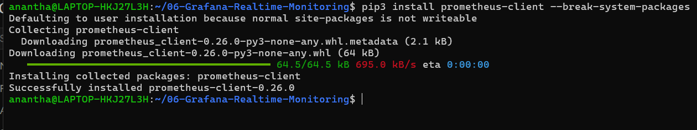

### Metrics Script

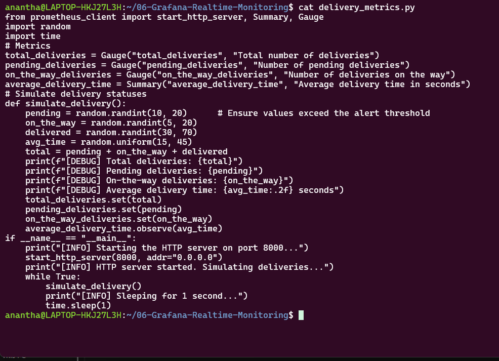

### Metrics Running

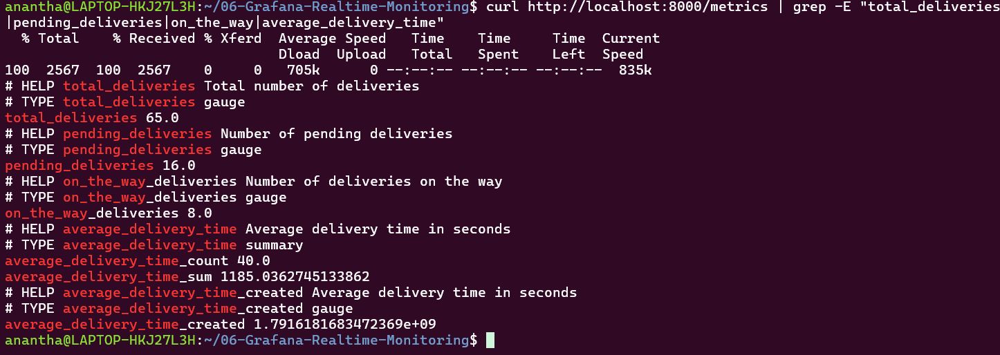

### Prometheus Configuration

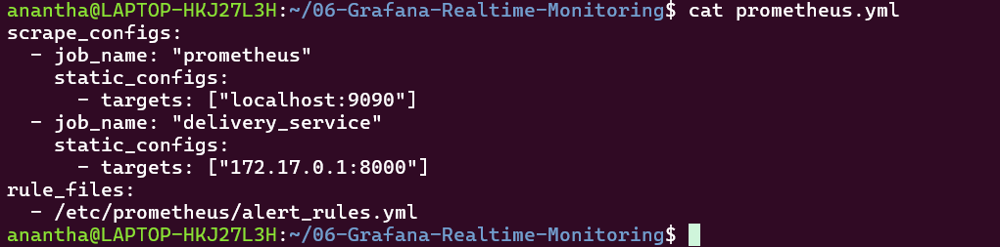

### Alert Rules

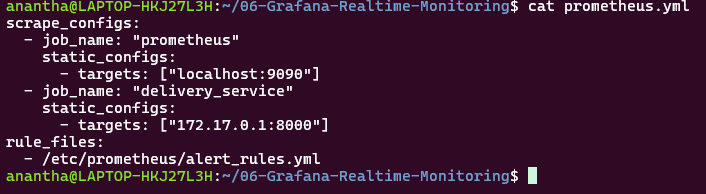

### Prometheus UI

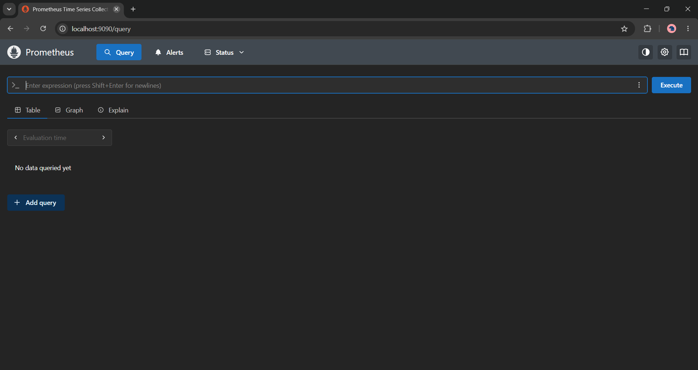

### Prometheus Targets

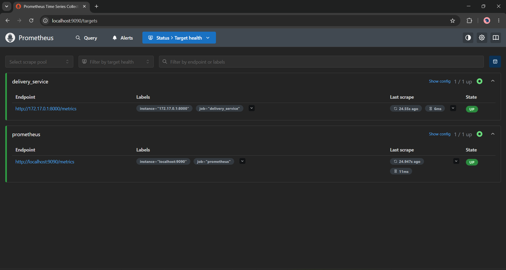

### Prometheus Graph

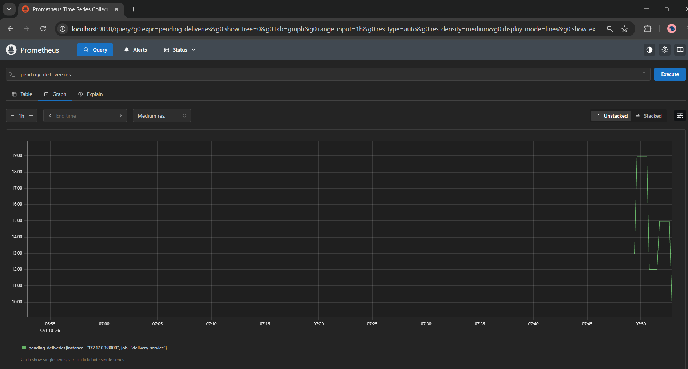

### Grafana Login

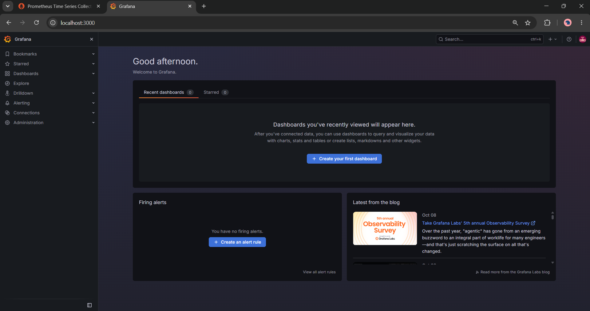

### Grafana Data Source

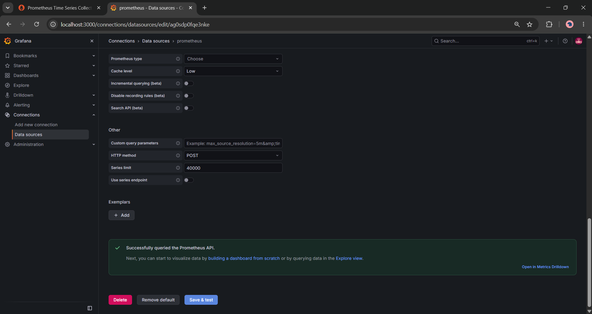

### Grafana Dashboard

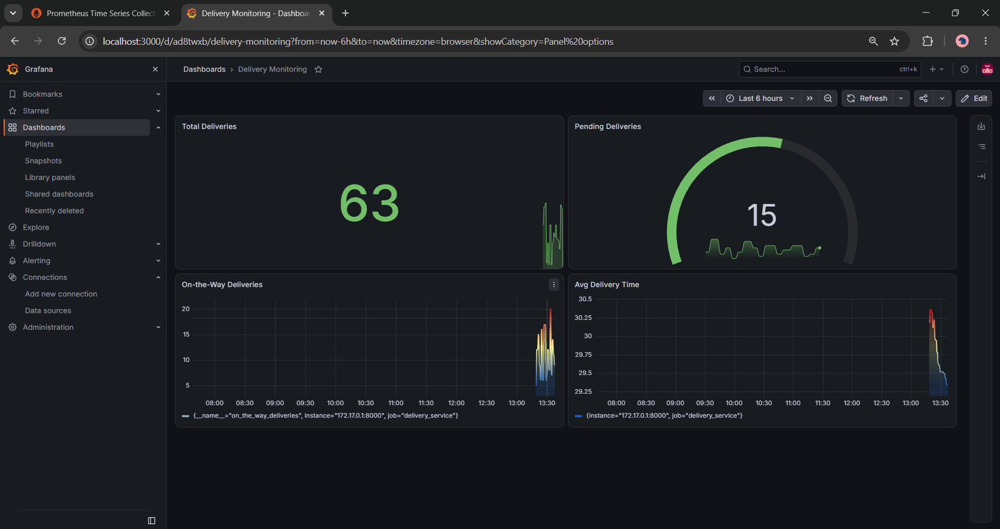

### Prometheus Alerts

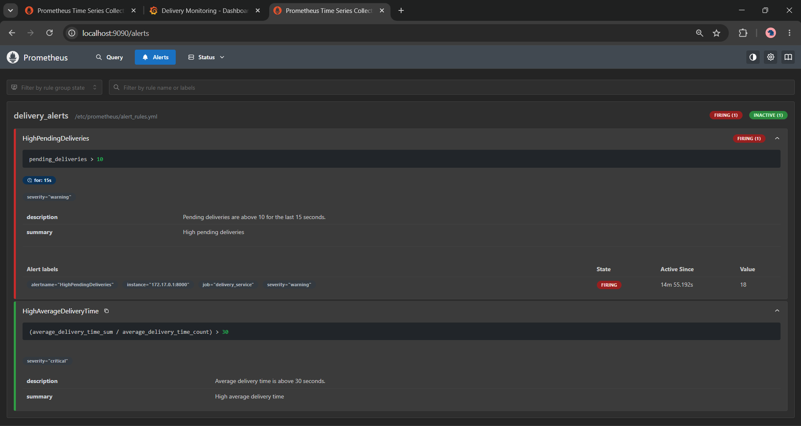

### Jenkins Pipeline

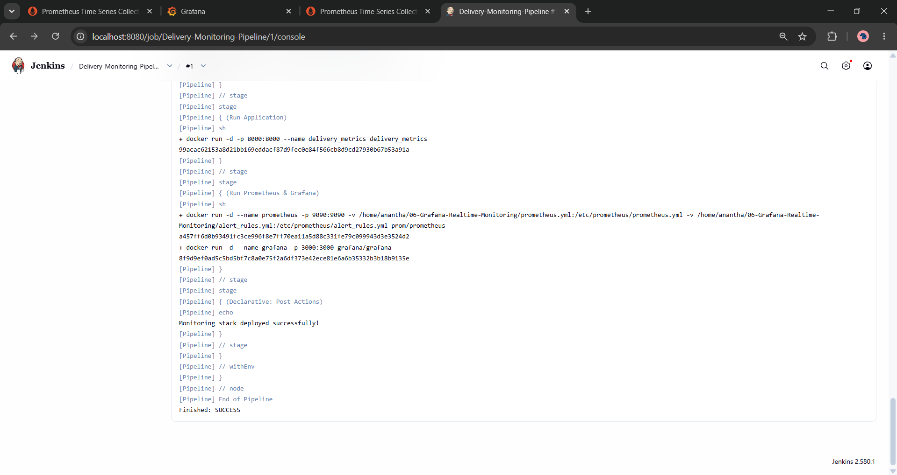

### Simulated Alerts

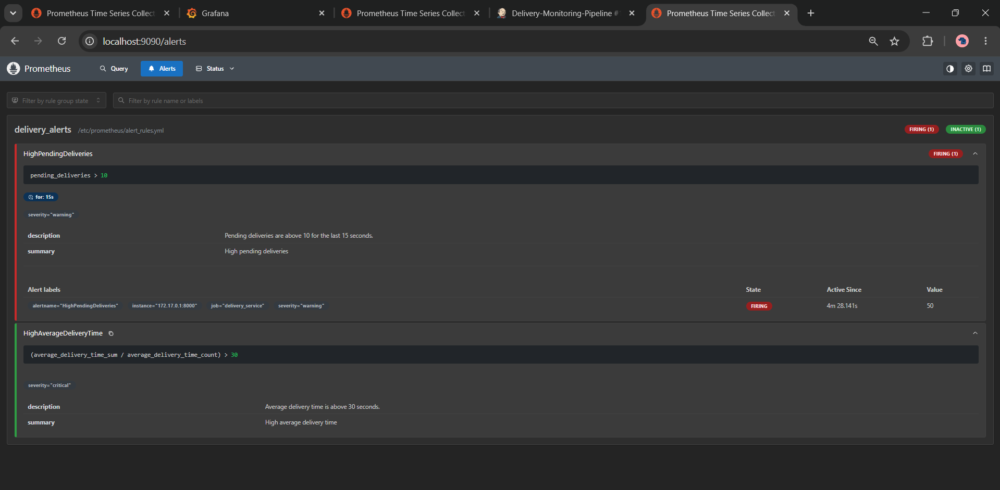

---

## Verification Summary

| Item                               | Expected Value                                             |
| ---------------------------------- | ---------------------------------------------------------- |
| **Python Metrics Server**          | Running on port `8000`, serving `/metrics`                 |
| **Prometheus**                     | Running on `9090`, both targets UP                         |
| **Grafana**                        | Running on `3000`, dashboard with 4 panels                 |
| **Alert: HighPendingDeliveries**   | FIRING                                                     |
| **Alert: HighAverageDeliveryTime** | FIRING / PENDING                                           |
| **Jenkins Pipeline**               | All stages green; Console Output shows the Docker commands |
| **Alert Simulation**               | `pending` 50–100 → alert firing, visible spike in Grafana  |

---

## Cleanup

```bash
# Stop the Python metrics script (Ctrl+C)

docker stop prometheus grafana delivery_metrics jenkins 2>/dev/null
docker rm   prometheus grafana delivery_metrics jenkins 2>/dev/null
docker rmi  delivery_metrics

docker ps -a
```

---

## Troubleshooting

| Problem                                            | Solution                                                                                                     |
| -------------------------------------------------- | ------------------------------------------------------------------------------------------------------------ | -------------------------------- |
| `pip3 install` → `externally-managed-environment`  | `pip3 install prometheus-client --break-system-packages`, or use a venv                                      |
| Prometheus target DOWN                             | Script still running? Target host right — `172.17.0.1` on Linux/WSL, `host.docker.internal` on Windows/macOS |
| `--network=host` not working on Windows            | Use `-p 9090:9090` and set the target to `host.docker.internal:8000`                                         |
| Grafana can't reach Prometheus                     | Data source URL `http://172.17.0.1:9090` (or `host.docker.internal`), not `localhost`                        |
| Dashboard shows "No data"                          | Save & Test the data source; check the metric name spelling                                                  |
| Jenkins stage: `docker: not found`                 | Install the CLI in the container and mount the socket — see Step 14b                                         |
| Jenkins stage: `permission denied ... docker.sock` | `chmod 666 /var/run/docker.sock` inside the container (lab-only shortcut)                                    |
| Pipeline fails: container name already in use      | The `Clean Previous Run` stage handles it; otherwise `docker rm -f prometheus grafana delivery_metrics`      |
| Port 8000/9090/3000 in use                         | `ss -ltnp                                                                                                    | grep <port>` and stop the holder |

---
